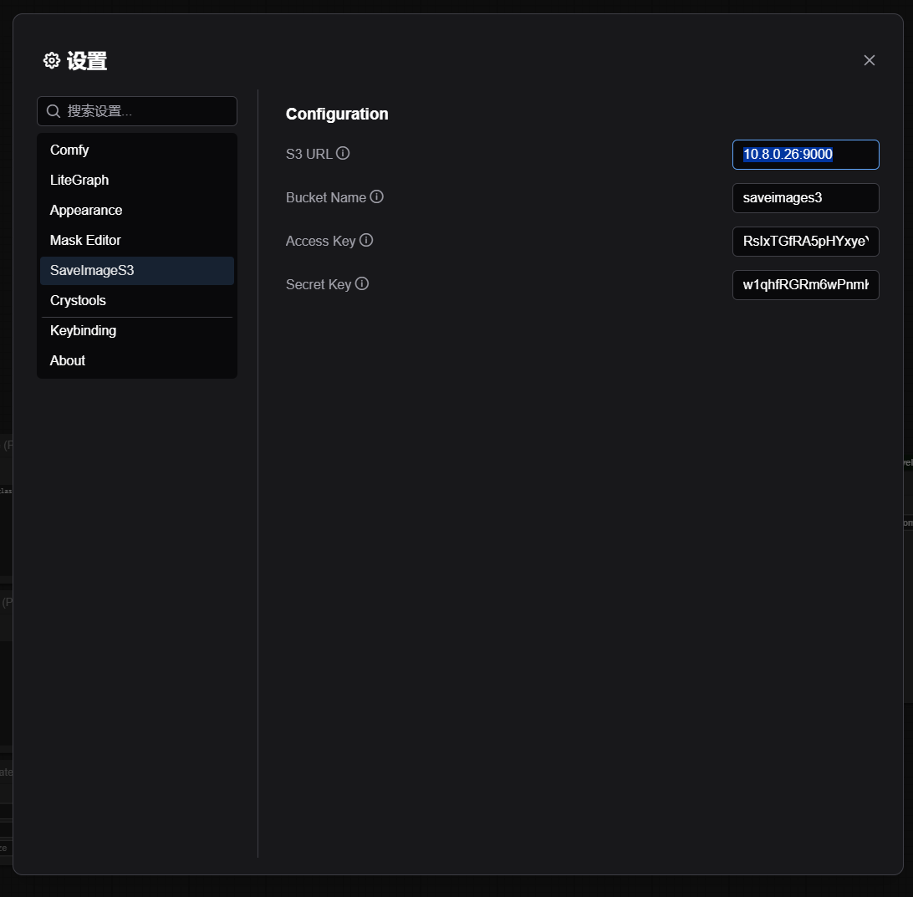
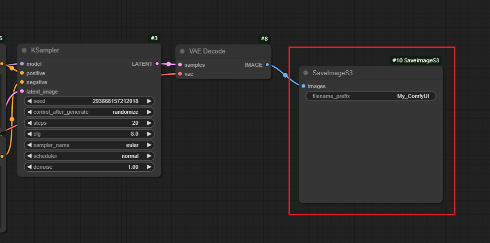

# ComfyUI-SaveImageS3
This is a comfyui custom node to save image to minio and S3-compatible system. It will save the image and as well as the workflow setup and prompt.

## Usage

1. Setup the S3 connection information in setting window
2. Fill in the S3 connection information including endpoint, bucket, access key and secret key.

3. Drag the node into your flow and fill in the image prefix. This custom node is extened by the offical save file node. So, it will also save a copy to local disk just like the official node does.

